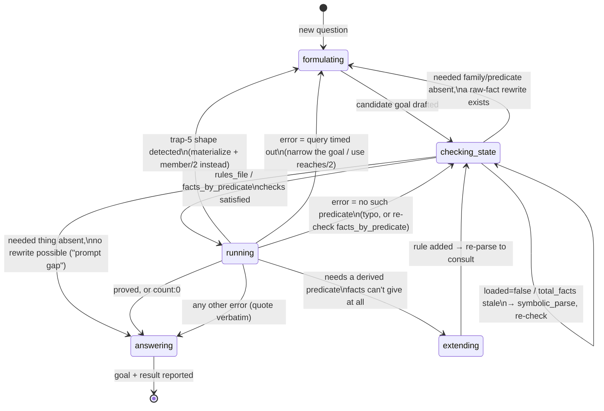

# Design: Modeling the MCP Server's Parse/Query Flow with `gen_statem`

A design/research document only — nothing here is implemented. It answers
one question: could OTP's `gen_statem` behaviour capture the flow
`.pi/SYSTEM.md` describes, and where would it actually help versus just
being a different way to write the same thing?

## 1. Two different "flows" are bundled in that question

`.pi/SYSTEM.md`'s `<workflow>`/`<state>` sections describe two things at
once, and they don't need the same fix:

1. **The agent-facing protocol**: call `parse` before `query`, check
   `rules_file` before using a derived predicate, expect `parse` to replace
   one cache entry and leave every other one untouched. This is a contract
   about call *order* across separate MCP tool invocations, enforced today
   by data (a map lookup), not by disallowing the call itself — see §2.
2. **The server-internal life of one `query` call**: parse the goal string,
   spawn a worker, wait for it with a timeout, reply. This already *is* a
   small state machine (`idle → proving → idle`), just written as a bare
   `spawn_monitor` + `receive … after` inside a `gen_server:handle_call/3`
   clause, with no state named anywhere in the source.

`gen_statem` has real, mechanical leverage over (2). Its leverage over (1)
is closer to renaming what already works — worth doing for legibility, but
not a behavior change. §5 covers both, in that order of actual payoff; §8
does the renaming for (1) properly, since "closer to renaming" was an
assertion this document hadn't actually earned yet.

## 2. What `symbolic_codebase.erl` actually does today

Grounded in the current source (`src/symbolic_codebase.erl`, read directly
— this is control-flow logic a Prolog fact base extracted from the same
file can't narrate, only point at; see the branch-count query in §7),
not a summary from memory:

- One registered `gen_server` (`?MODULE`), state `#{caches => #{Dir =>
  #{erl, meta}}, current => Dir | undefined}`.
- `handle_call({parse, Dir, RulesOverride}, ...)` — two clauses (`Dir`
  `undefined` vs given), each wrapped in `safely/2` (a `try/catch` that
  returns `State` unchanged on any crash — issue #4's fix). Every branch
  routes through `finish_parse/6`, which either replaces exactly one
  `caches` entry and sets `current`, or leaves `State` completely
  untouched on any error (bad path, bad rules file, scan crash).
- `handle_call({query, Goal, Limit, Path}, ...)` — resolves which cache
  entry to use (`resolve_cache_entry/2`), parses the goal string, then
  calls `prove_all_with_timeout/3`, which does exactly the blocking
  pattern described above: `spawn_monitor`, then a bare
  `receive {Pid, Result} -> ...; {'DOWN', ...} -> ... after
  ?QUERY_TIMEOUT_MS -> exit(Pid, kill), {error, timeout} end`.
- `handle_call({overview, Path}, ...)` — a pure read of `resolve_cache_entry/2`.

The important consequence: **that `receive … after` runs inside
`handle_call`, which blocks the entire `gen_server` process** — its whole
mailbox, not just the caller — for up to `?QUERY_TIMEOUT_MS` (10 s). A
`parse` or `overview` call for a *completely different, already-cached*
project queues behind it and waits, even though nothing about that other
project's cache entry is being touched. Nothing today measures whether
this matters in practice (§6) — it's a real property of the code, not
yet a proven problem.

## 3. `gen_statem`, verified against the OTP reference (not recalled from memory)

Fetched from `erlang.org/doc/apps/stdlib/gen_statem.html` for this
document, since getting an action type wrong here would be exactly the
kind of unverified claim this project's own tooling exists to catch:

- **`callback_mode/0`** returns `state_functions` (state must be an atom;
  engine calls `Module:StateName/3`) or `handle_event_function` (state can
  be any term; engine calls `Module:handle_event/4` for every state) —
  optionally combined with `state_enter` in a list.
- **Action types** relevant here:
  - `{reply, From, Reply}` — reply to a call from any state callback, not
    only the one that received it.
  - `postpone` / `{postpone, true}` — postpone the current event; "after a
    state change (`NextState =/= State`), it is retried." A state change
    to the *same* state does not retry it.
  - `{state_timeout, Time, EventContent}` — arms a timer that, on expiry,
    delivers an event of type `state_timeout`; cancelled by any state
    change away from the state that armed it.
  - `{next_event, EventType, EventContent}` — inserts a synthetic event
    for immediate processing, before any queued external event.
- **Return shape**: `{next_state, NextState, NewData, Actions}` — the
  engine transitions to `NextState`, replaces the data term, then runs
  `Actions` in order.
- **`state_enter`**: if declared in `callback_mode/0`'s list, the engine
  calls the state callback with `(enter, OldState, Data)` on every state
  change (including the initial state, where `OldState =:= State`) before
  any queued event is delivered to the new state. Enter calls may not
  change state and may only use a restricted `enter_action()` subset (no
  `postpone`, no `next_event`).

`gen_statem` is OTP stdlib — no new dependency, matching this project's
existing preference (`docs/testing-erlang.md`'s "Recommendation up
front") for zero-dependency tooling wherever stdlib already covers it.

## 4. What would *not* change

Whichever design below is chosen, the MCP-facing contract in
`.pi/SYSTEM.md` stays exactly as documented: `parse` still replaces one
cache entry and leaves every other one untouched; `query`/`overview`
still take the same optional `Path`; every error shape
`symbolic_serve_tests.erl` and `docs/agent-examples.md` already pin down
is unchanged. This is an internal implementation swap behind
`symbolic_codebase:parse/1,2`, `query/1,2,3`, `overview/0,1` — not a
protocol change, and (per `docs/testing-erlang.md`'s stated preference
against mocking) the existing tests that call those functions directly
against a real running process wouldn't need to change either.

## 5. Two candidate designs

### Design A — one `gen_statem` replacing the single `gen_server`, states `idle` / `proving`

The smallest change with `gen_statem` mechanics genuinely in play. Data
stays the same shape (`#{caches, current}`, unchanged); `parse` and
`overview` are handled identically to today (they're pure/fast — no
reason to model them as separate states). `query` becomes the
`idle -> proving -> idle` cycle:

```erlang
callback_mode() -> [state_functions, state_enter].

idle(enter, _OldState, _Data) ->
    keep_state_and_data;
idle({call, From}, {parse, Dir, RulesOverride}, Data) ->
    %% same body as today's handle_call({parse,...}) clauses
    {keep_state, NewData, [{reply, From, Result}]};
idle({call, From}, {overview, Path}, Data) ->
    {keep_state_and_data, [{reply, From, resolve_and_read(Path, Data)}]};
idle({call, From}, {query, Goal, Limit, Path}, Data) ->
    case resolve_cache_entry(Path, Data) of
        {error, Reason} ->
            {keep_state_and_data, [{reply, From, {error, Reason}}]};
        {ok, #{erl := Erl}} ->
            {Pid, Ref} = spawn_worker(Goal, Erl, Limit),
            {next_state, {proving, From, Pid, Ref}, Data,
             [{state_timeout, ?QUERY_TIMEOUT_MS, worker_timeout}]}
    end.

proving(enter, _OldState, _Data) ->
    keep_state_and_data;
%% Everything else queues instead of blocking — a `parse`/`overview` for
%% ANY project (including a different one) is postponed, not dropped,
%% and is retried the instant we're back in `idle`.
proving({call, _From}, _Request, _Data) ->
    {keep_state_and_data, [postpone]};
proving(info, {'DOWN', Ref, process, Pid, Reason}, {proving, From, Pid, Ref} = _State) ->
    gen_statem:reply(From, translate_worker_result(Reason)),
    {next_state, idle, Data};
proving(state_timeout, worker_timeout, {proving, From, Pid, _Ref}) ->
    exit(Pid, kill),
    gen_statem:reply(From, {error, timeout}),
    {next_state, idle, Data}.
```

This directly replaces the bare `receive … after` with first-class
transitions and a named timeout, and — the one real behavior change —
`parse`/`overview` for a *different* project no longer wait behind an
in-flight query; they're postponed and retried the moment the query
resolves or times out. A `query` for the *same or another* project still
queues behind it, same as today (there's still only one process). Note
this is `postpone` used unconditionally in `proving`, which is safe but
coarser than it could be — see Design B.

### Design B — one `gen_statem` *per parsed project*, supervised

The more invasive option, and the one that actually removes cross-project
blocking rather than shortening its window: `symbolic_codebase` becomes a
thin registry (project root → `Pid`), and each parsed project gets its own
`gen_statem` with the same `idle`/`proving` states as Design A, started
(and, on a fresh `parse` of the same key, replaced) via a supervisor. This
is not a new pattern for this codebase — read directly, not assumed:
`prolog_session_sup` is a `simple_one_for_one` supervisor that spawns one
`prolog_session` worker per call to `start_child/0`, and
`prolog_session_registry` maps an opaque MCP session ID to that worker's
`Pid` via ETS, for a *different*, already-existing MCP tool surface
(`prolog_consult`/`prolog_query`/`prolog_end_session` — a lower-level,
session-scoped Prolog tool set, distinct from the `parse`/`query`/
`overview` tools `symbolic_serve.erl` exposes and this whole document is
about). The open question (§6) is whether Design B's per-project workers
belong under that same supervisor, a new sibling one, or shouldn't reuse
that tree at all, given the two tool surfaces serve different callers and
have different lifetimes (opaque, explicitly-ended sessions vs.
long-lived, keyed-by-project-root cache entries). Under this
design, a slow query against one project never delays a `parse` or
`overview` — or even a *concurrent query* — against a different one,
because they're different processes with different mailboxes. It also
means `current` (which key `query`/`overview` fall back to when `Path` is
omitted) has to live somewhere outside any one project's own process —
still the registry, most likely.

## 6. Open questions before either gets built

- **Is the blocking in §2 an actual problem, or a theoretical one?** One
  MCP client issuing one call at a time (this session's own usage
  pattern) never notices it. This project already has `erlperf`-based
  benchmarking scaffolding (`bench/`, `docs/benchmarking.md`) from a prior
  real performance fix — the right next step is a benchmark that starts
  two cached projects and measures a `parse`/`overview` call's latency
  against project B while a slow query runs against project A, *before*
  picking a design, the same "measure it, don't guess" discipline that
  fix was built on.
- **Does Design B's per-project process belong under
  `prolog_session_sup`, a new sibling supervisor, or somewhere else
  entirely?** Not decided here — `prolog_session_sup`/
  `prolog_session_registry` exist for the separate `prolog_consult`/
  `prolog_query`/`prolog_end_session` tool surface (confirmed by reading
  both modules directly for this document), so reusing them for
  `symbolic_codebase`'s per-project workers would mean two different
  MCP tool surfaces sharing one supervision tree — worth a deliberate
  decision, not an assumption.
- **Testing**: Design A keeps the same three-function public API, so
  `symbolic_codebase_tests.erl`/`symbolic_serve_tests.erl` need no
  changes. Genuinely new behavior — "a query against project A doesn't
  delay an overview of project B" — has no test today (because it isn't
  true today) and would need one under either design; per
  `docs/testing-erlang.md`'s stance, that's a real-process integration
  test (two real cache entries, one slow query), not a `meck`-based one.
- **Is `postpone` in Design A's `proving` state too coarse?** As sketched,
  it postpones *every* call while proving, including a `query` against an
  unrelated project — same blocking behavior as today for that one case.
  Distinguishing "a request that touches the busy entry" from "a request
  that doesn't" inside a single process is possible (inspect the request
  before deciding to postpone) but starts to reintroduce Design B's
  per-key isolation without its process boundaries — worth deciding
  explicitly rather than drifting into it.

## 7. What the fact base already told us, for the record

Per this project's own rule (`.pi/SYSTEM.md` `<rule>` 1) — the codebase
question "how complex/branchy is the module this doc is about" was asked
of the engine, not guessed:

```prolog
?- findall(F/A-K-Line, branch(F,A,K,'src/symbolic_codebase.erl',Line), L), length(L,N).
N = 43.
```

```prolog
?- too_complex(F, 'src/symbolic_codebase.erl', Count).
F = handle_call, Count = 13.   % (returned 4 times — once per handle_call/3
                                 clause; too_complex/3 has no Arity/clause
                                 key, so a multi-clause function repeats)
```

`handle_call/3`'s fan-out of 13 distinct call targets — already flagged
by this project's own `too_complex/3` rule (threshold: 10), independently
of this document — is the same complexity this document is proposing to
redistribute into named states, which is corroborating evidence for §1's
framing, not a coincidence introduced by this doc.

## 8. Modeling `<workflow>` itself — the agent-facing protocol, done properly

§1 asserted `gen_statem`'s leverage over the agent-facing protocol was
"closer to renaming" without actually deriving the states. Doing that
derivation carefully turns out to matter: the five numbered steps in
`.pi/SYSTEM.md`'s `<workflow>` block are not a straight line. Steps 2 and
3 each contain a guard that can send control backward, and step 5's "an
error is not \[an answer\] — quote it as it came back" only makes sense
once the retry decision has already happened somewhere earlier — which
step 5 itself never describes. That decision lives in the separate
`<errors>` section, which the numbered list doesn't inline: "query timed
out" says narrow the goal; "no such predicate" says call `overview`. Five
states fall out once those are folded back in:

| State | Corresponds to | Entry action |
|---|---|---|
| `formulating` | step 1 | Draft one goal (conjunctive if multi-step); check `<library>` first |
| `checking_state` | step 2 | Call `overview`; parse if stale; verify `rules_file`/`facts_by_predicate` against what the drafted goal needs |
| `running` | step 3 | Guard against the trap-5 shape (`<dialect>` trap 5), then call `query` |
| `extending` | step 4 | Edit `.symbolic/rules.pl` (or use a one-off `rules` override) |
| `answering` | step 5 | Report bindings, `count:0`, or the verbatim error — terminal for this question |



Three things this makes explicit that the prose leaves implicit:

1. **Two different retry loops land in two different states.** A timeout
   means the *goal* was wrong (`formulating`); an existence error means
   the picture of what's loaded was wrong (`checking_state`). Retrying
   either kind of error with the same fix (e.g., re-running the identical
   goal against the same cache on a timeout) is a distinguishable protocol
   violation once the states are named — it isn't, when both are just
   "try again" in prose.
2. **`count:0` and "proved" take the identical edge**, `running →
   answering`. Nothing about the state machine treats failure specially —
   `<rule>` 4 ("a failure is the answer") falls out of the transition
   table structurally, rather than needing to be stated and separately
   remembered.
3. **`answering` is a genuine terminal state, per question.** Nothing
   loops back into it from outside; a new question re-enters at
   `formulating`. The machine is re-entrant across questions, not cyclic
   within one.

### What's actually worth building here

Two different things could sit behind this diagram, and they have very
different weight:

**(a) Documentation only.** The diagram above, kept next to
`.pi/SYSTEM.md` as a legibility aid. Zero runtime behavior. This is all
§1's "closer to renaming" claim actually licensed.

**(b) A `gen_statem` *observer*, not a gate.** The workflow lives in an
LLM agent's own tool-call sequence, not inside `symbolic_serve.erl`'s
handlers, and §4's constraint still applies here: making `query` auto-
parse on a cold cache instead of erroring, so that step 2's discipline is
enforced rather than merely followed, would change a contract
`symbolic_serve_tests.erl` already pins down. The honest version is a
session-scoped process that *watches* the sequence of tool calls
already flowing through `symbolic_serve.erl` (every `parse`/`query`/
`overview` invocation is already logged there via `?LOG_INFO`/
`?LOG_ERROR`) and tracks which of these five states a session is
actually in, without changing what any tool call does. Modeled as a
`gen_statem` with `callback_mode() -> state_functions`, states named
exactly as in the table above, and `Data` carrying the current question,
the last goal tried, and the last error seen, it can flag a transition
this table doesn't contain — most usefully, "`running` fired again on an
unchanged goal after a `query timed out` event," which is precisely the
failure mode `<errors>`' "do not report the partial solutions you
already saw as the answer set" warns against, now checkable mechanically
instead of only by a reviewer reading a transcript.

This connects to a use this project has already written down elsewhere:
`docs/grpo-prolog-tool.md` argues for reward-shaping signals over an
agent's Prolog-tool trajectories during RL training. "Did this trajectory
follow the disciplined workflow" is exactly that kind of signal, and this
state table is its formal spec — a natural next step for that document,
not this one, if it's worth pursuing.
